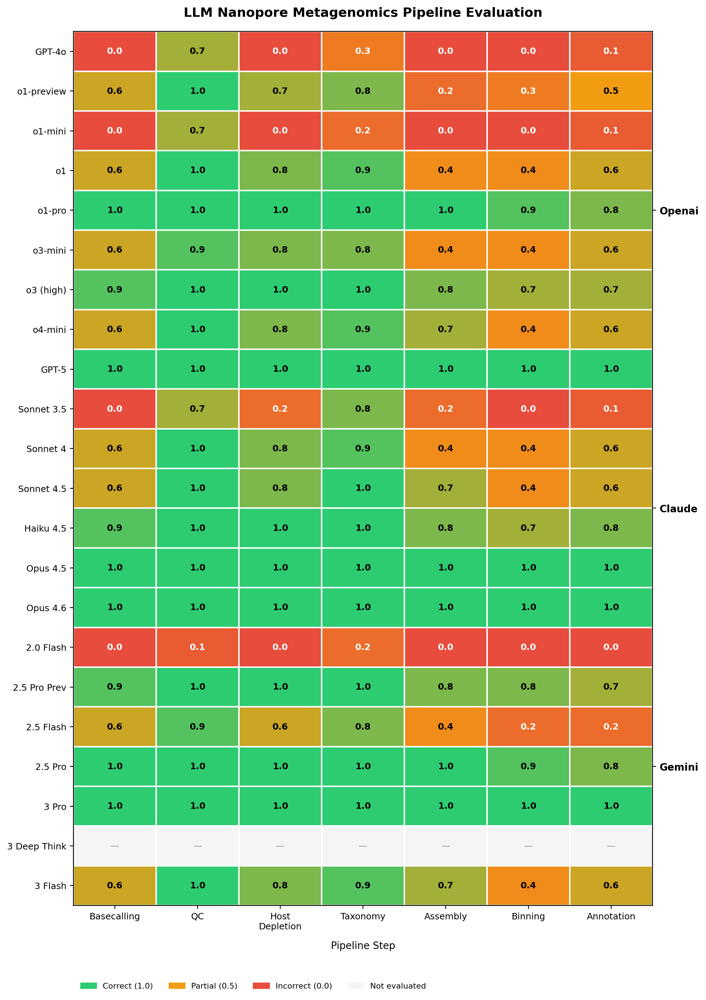

# Systematic Evaluation of Large Language Models for Nanopore Metagenomics Pipeline Development

[](LICENSE)

## Purpose

This repository documents a structured evaluation of large language models (LLMs) for their ability to generate correct, production-ready nanopore metagenomics pipelines through sequential prompting.

Most existing LLM benchmarks for code generation test isolated tasks: "write a function that does X." But real bioinformatics pipeline development is sequential — each step produces output that becomes input for the next, tool choices constrain downstream options, and errors compound. A model that selects the wrong tool at step 3 will produce a pipeline that fails at step 4, even if every subsequent code block is syntactically correct.

This evaluation tests whether LLMs can maintain scientific and technical correctness across a full pipeline, not just within individual steps.

### Why this matters

The dominant failure mode observed is **"plausible but wrong"**: generated code that runs, looks reasonable, and would pass a surface-level review — but makes choices that a domain expert would immediately reject. Examples include recommending short-read tools for long-read data, using deprecated software, or setting parameters that are syntactically valid but scientifically inappropriate.

These failures are invisible to automated code-correctness benchmarks and dangerous precisely because they are plausible.

## Experimental Design

### Ground truth

The reference pipeline is the validated workflow from:

> Reska T, Pozdniakova S, Urban L. "Air monitoring by nanopore sequencing." *ISME Communications* (2024). DOI: [10.1093/ismeco/ycae058](https://doi.org/10.1093/ismeco/ycae058)

This pipeline processes Oxford Nanopore long-read sequencing data from low-biomass environmental samples generated with the Rapid Barcoding Kit (RBK114.24). It was developed, validated, and published independently of any LLM assistance.

### Sequential prompting protocol

Each model was evaluated using the same sequence of prompts, where each prompt:

1. Specifies the pipeline step to implement
2. Provides the output context from the previous step
3. Requests runnable code with tool selection rationale

The prompts were designed to simulate how a scientist actually develops a workflow in conversation with an LLM — incrementally, building each step on the last. See [`methodology/evaluation_framework.md`](methodology/evaluation_framework.md) for the full protocol.

### Models tested

| Family | Version | Notes |
|:-------|:--------|:------|
| ChatGPT | GPT-4o | [PLACEHOLDER: date tested] |
| ChatGPT | o3-mini | [PLACEHOLDER: date tested] |
| ChatGPT | o3 (high reasoning) | [PLACEHOLDER: date tested] |
| Claude | Sonnet 3.5 | [PLACEHOLDER: date tested] |
| Claude | Sonnet 4 | [PLACEHOLDER: date tested] |
| Gemini | 2.0 Flash | [PLACEHOLDER: date tested] |
| Gemini | 2.5 Pro Preview | [PLACEHOLDER: date tested] |

[PLACEHOLDER: additional intermediate model versions to be added]

### Pipeline steps

| Step | Objective |
|:-----|:----------|
| 1 | Basecalling, adapter trimming, and length filtering |
| 2 | Quality control and read statistics |
| 3 | Host/human DNA depletion |
| 4 | Taxonomic classification of reads |
| 5 | Metagenomic assembly |
| 6 | Binning and MAG quality assessment |
| 7 | Functional annotation |

[PLACEHOLDER: confirm and expand step list]

## Scoring Framework

Each model × step combination is evaluated across five dimensions:

| Dimension | Levels | What it tests |
|:----------|:-------|:--------------|
| **Tool Selection** | Correct / Acceptable / Incorrect | Did the model choose an appropriate tool for nanopore long-read data? |
| **Parameter Accuracy** | Correct / Partially Correct / Incorrect | Were flags, thresholds, and kit-specific settings appropriate? |
| **Output Compatibility** | Pass / Fail | Does the output chain correctly into the next step? |
| **Scientific Validity** | Sound / Questionable / Incorrect | Are the analytical choices defensible for this data type? |
| **Executability** | Runs / Runs with Minor Fixes / Does Not Run | Does the generated code actually execute? |

Detailed rubrics with concrete examples are in [`methodology/scoring_criteria.md`](methodology/scoring_criteria.md).

## Key Findings

[PLACEHOLDER: summary of key findings — insert after completing all evaluations]

**Headline result:** No LLM produced a fully correct end-to-end pipeline until the latest model generation:

- **ChatGPT:** first fully correct at o3 (high reasoning)
- **Claude:** first fully correct at Sonnet 4
- **Gemini:** first fully correct at 2.5 Pro Preview

[PLACEHOLDER: insert heatmap figure]

```

```

[PLACEHOLDER: discussion of error patterns, compounding failures, and most common failure modes per step]

## Repository Structure

```
├── methodology/          Evaluation protocol, scoring rubrics, ground truth pipeline
├── prompts/              Standardized prompts used for each pipeline step
├── responses/            Raw, unedited LLM responses organized by model family/version
├── evaluations/          Scored evaluations organized by step and by model
├── results/              Generated figures and summary tables
│   ├── figures/          Heatmaps and other visualizations
│   └── tables/           Scoring matrix (CSV)
└── scripts/              Python scripts for generating figures and summaries
```

## How to Use This Repository

### For scientists evaluating LLMs for bioinformatics

1. Read [`methodology/evaluation_framework.md`](methodology/evaluation_framework.md) for the evaluation protocol
2. Review [`methodology/pipeline_reference.md`](methodology/pipeline_reference.md) for the ground truth pipeline
3. Browse `evaluations/by_step/` to see how models performed on specific pipeline stages
4. Check `evaluations/by_model/` to track improvement across model versions

### For AI researchers studying domain-specific code generation

1. The scoring framework in [`methodology/scoring_criteria.md`](methodology/scoring_criteria.md) provides a reusable rubric
2. Raw prompts in `prompts/` and responses in `responses/` are available for analysis
3. The sequential evaluation design tests compositional correctness, not just isolated task performance
4. `results/tables/scoring_matrix.csv` provides the structured data for quantitative analysis

### Reproducing figures

```bash
pip install pandas matplotlib seaborn
python scripts/generate_heatmap.py
python scripts/aggregate_scores.py
```

## Limitations

- Models were tested via web interfaces, not APIs. Behavior may differ between access methods.
- Knowledge cutoff dates affect which tools models recommend; newer models may benefit from training on more recent bioinformatics literature.
- Sequential prompting means earlier errors can influence later responses. This is by design (it reflects real usage) but complicates isolation of per-step capability.
- The ground truth is one validated pipeline for one specific data type. Alternative valid approaches exist, and the scoring framework accounts for this via the "Acceptable" category.
- Sample size is small (one evaluation per model version per step). Stochastic variation in LLM outputs means individual runs may not be representative.

[PLACEHOLDER: additional limitations identified during evaluation]

## Citation

If you use this evaluation framework or reference these results, please cite:

```bibtex
@misc{reska2025llmeval,
  author = {Reska, Tim},
  title = {Systematic Evaluation of Large Language Models for Nanopore Metagenomics Pipeline Development},
  year = {2025},
  url = {https://github.com/ttmgr/llm-metagenomics-eval}
}
```

Reference pipeline:

```bibtex
@article{reska2024airmonitoring,
  author = {Reska, Tim and Pozdniakova, Svitlana and Urban, Lara},
  title = {Air monitoring by nanopore sequencing},
  journal = {ISME Communications},
  year = {2024},
  doi = {10.1093/ismeco/ycae058}
}
```

## License

[MIT License](LICENSE) — Tim Reska, 2025
